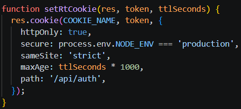
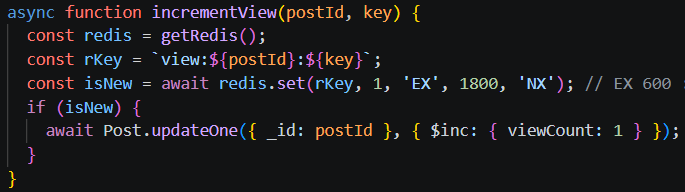
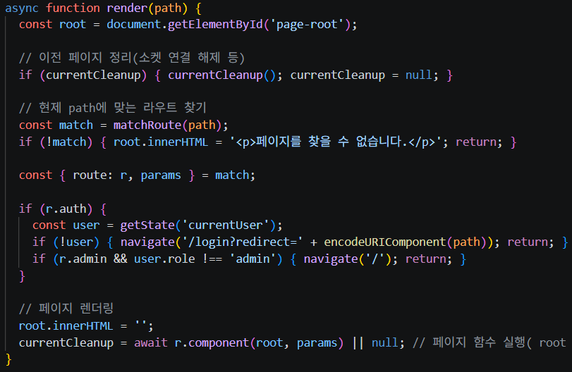
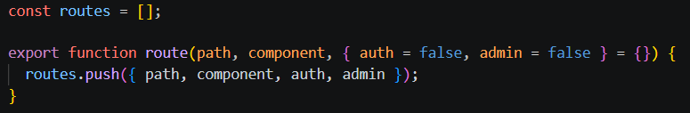
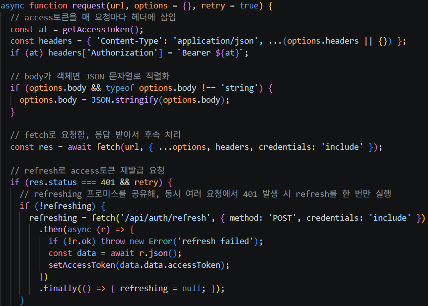
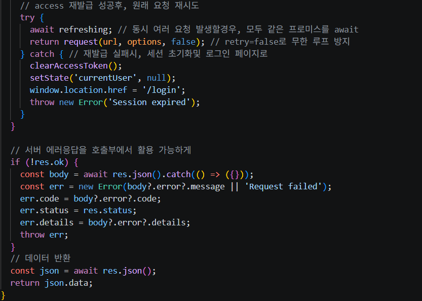
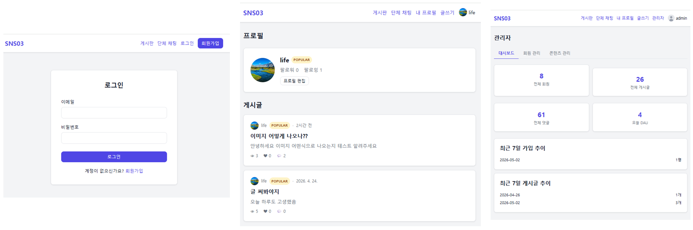
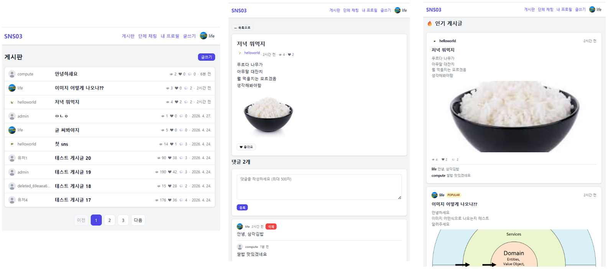
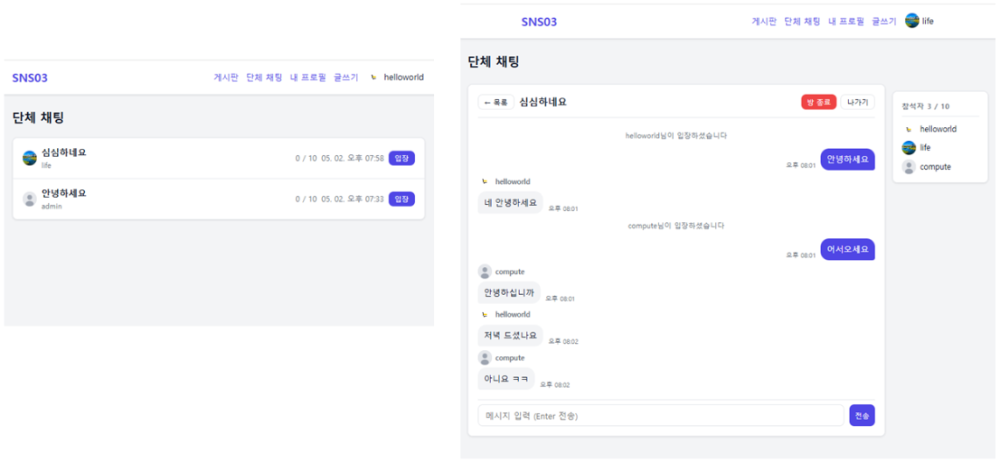

# SNS03
* 게시판(이미지 첨부 글, 댓글, 좋아요)과 단체 채팅기능이 있는 작은SNS
* 기존에 SpringBoot + MySQL 이던걸 **Express + MongoDB로 컨버트**
   * https://github.com/doriver/xxSNS

해당 README는 작성중(미완성)입니다.

### JWT 인증

  
Access, Refresh 토큰

  

    <ul>
      <li> Access는 브라우저의 Session Storage에 저장된다. 요청시 Authorization헤더에 담겨 서버에 전달된다.
      </li>
      <li> Refresh는 브라우저의 쿠키와 서버쪽 Redis에 저장된다. Access만료됐다는 서버의 응답을 받을때 재발급 요청에서 서버에 전달된다.    
      </li>
      
      <li> access를 요청에 담는 것과, 재발급 요청은  
           프론트 요청api의 공통 메서드에서 이루어진다.
      </li>
    </ul>
  

### 게시판

  
게시글 조회수

  

    <ul>
      <li> 로그인한 유저는 userId , 비로그인 유저는 ip를 기준으로 조회수 증가
      </li>
      <li> Redis로 조회수 중복 방지  
         : 같은 사용자가 30분 내에 재조회하면 카운트x (TTL 30분)
      </li>
      
    </ul>
  

### 프론트

  
순수JS로 SPA

  

    <ul>
      <li> render함수 - page함수로 브라우저 DOM에 직접 HTML을 씀
      </li>
      
      <li> page함수 - DOM노드에 넣을 HTML및 js이벤트 정의
      </li>
      <li> main.js에서 경로와 페이지함수를 route로 등록해놈
      </li>
      
      <li> 공유 인메모리 객체 state를 사용해 get/set
      </li>
    </ul>
  

  
요청api 

  

    <ul>
      <li> 요청api 메서드를  
          core 메서드 -> http 레이어 -> domain 레이어 , 로 래핑해서 계층적으로 구성
      </li>
      <li> core 메서드  
          - 인증(jwt토큰)관련 처리 , body데이터 타입 , 서버 에러응답 파싱
      </li>
      
       
      
    </ul>
  

### 주요 View

  
01

  

    <ul>
      <li> 로그인 , 유저 프로필 , 관리자 페이지
      </li>
      
    </ul>
  

  
02

  

    <ul>
      <li> 게시글 목록 , 게시글 상세 , 홈
      </li>
      
    </ul>
  

  
03

  

    <ul>
      <li> 채팅방 목록 , 단체 채팅방
      </li>
      
    </ul>
  

